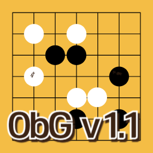

# ObG (Omok by GPT)

## 목차
1. [소개](#소개)
2. [제작 정보](#제작-정보)
3. [업데이트 내역](#업데이트-내역)
   - [v1.1 – 2025-04-23](#v11-–-2025-04-23)
   - [v1.0 – 2025-04-20](#v10-–-2025-04-20)
4. [주요 기능](#주요-기능)
5. [향후 로드맵](#향후-로드맵)
6. [피드백](#피드백)
7. [다운로드](#다운로드)

---

## 소개
**ObG (Omok by GPT)**는 ChatGPT를 활용하여 개발한 GUI 기반 오목 프로그램입니다. 이전에 C언어로 작성했던 텍스트 기반 오목 경험을 바탕으로, ChatGPT와의 디버깅 과정을 통해 빠르게 핵심 기능을 구현했습니다.

---

## 제작 정보
- **제작자**: EATSTAR (https://github.com/eatstar-code)
- **개발 도구**: ChatGPT o4-mini-high, Visual Studio Code
- **개발 기간**: 약 2시간 반 (exe 배포 작업 제외)

---

## 업데이트 내역

### v1.1 – 전적 데이터베이스 지원, 메뉴 구성 변경 - 2025-04-23
- 전적 데이트베이스를 구축하여 프로그램을 다시 시작해도 전적을 볼 수 있습니다.
- 기존 하단에 있던 초기화, 전적, 업데이트 내역 기능이 상단 좌측에 기능별로 모아집니다.
- 메뉴를 누르면 새 게임(초기화->새 게임), 전적이 나옵니다.
- 정보를 누르면 업데이트 내역과 제작자(신설)가 나옵니다.
- 업데이트 정보, 제작자란에 내용을 좀 더 추가

### v1.0 – 기본적인 GUI 기반 오목 시스템 구현 - 2025-04-20
- 게임 정보 입력: 이름, 대국 일시(YYYY-MM-DD HH:MM), 제한 시간(분), 흑·백 플레이어
- 시간 초과 패배, 5줄 완성 시 승리 로직
- 전적 저장 및 조회 기능 제공

---

## 주요 기능
1. **GUI 오목 게임**
2. **게임 설정 및 입력**
   - 게임 이름 설정
   - 대국 일시(YYYY-MM-DD HH:MM)
   - 제한 시간(분)
   - 플레이어 이름(흑/백)
3. **게임 규칙**
   - 시간 초과 시 기권 처리
   - 5줄 완성 시 승리
4. **전적 관리**
   - 게임이 끝난 후 전적 저장
   - 프로그램 재실행시 전적 조회 기능

---

## 향후 로드맵
- 금수(3·3, 6목) 규칙 검출 및 방지
- AI 대국 기능 추가

---

## 피드백
프로그램 개선을 위한 의견이나 제안은 언제든 환영합니다.
- ✉️ eatstar.code@gmail.com

---

## 다운로드
- 파이썬 파일은 Visual Studio Code에서 직접 실행시키셔야 합니다.
- EXE 실행파일은 배포용으로는 운영체제에서 바이러스 오탐지로 막으므로 사실상 실행이 불가능합니다.
- docker 패키지로 실행시킬 수 있습니다. (v1.1부터 도입) 운영체제별 실행 방법은 다음과 같습니다.
   [Windows용 가이드](./windows_package.md)
   [Mac용 가이드] (준비중)
   [Linux용 가이드] (준비중)

### ObG v1.1
- 파이썬(py) 파일
   [다운로드 링크](https://drive.google.com/drive/folders/1o5I0frlaYAMUnts99rEjrnrp_jpqJDMt?usp=sharing) 
- 실행(EXE) 파일
   
- 패키지 파일
   [설치 코드](https://github.com/eatstar-code/ObG/pkgs/container/omok-gui/401512636?tag=1.1) 

### ObG v1.0
- 파이썬(py) 파일  
  [다운로드 링크](https://drive.google.com/file/d/1By4ZkZodfTU7roQ_NuHanuuwakvj9gOA/view?usp=sharing) 
- 실행(EXE) 파일
   [다운로드 링크](https://drive.google.com/file/d/1prH91aCBJrlwCgis_eEZyZ6KNi4BROLk/view?usp=sharing) 
- 패키지 파일
   v1.0 버전은 패키지 파일을 지원하지 않습니다.

---

© 2025 EATSTAR
